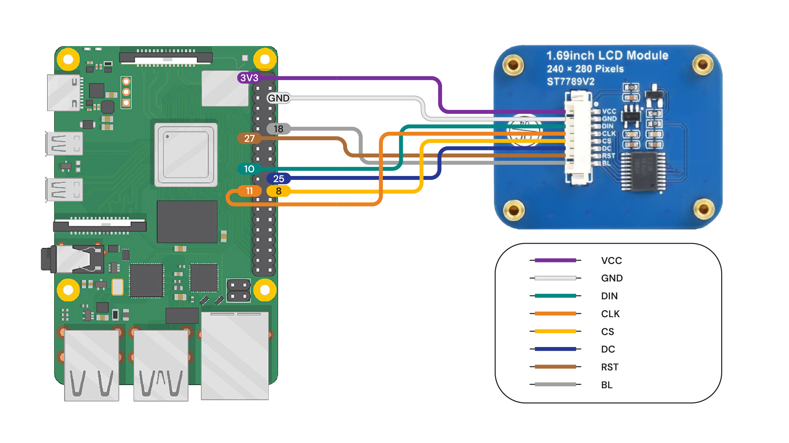

# LCD Dashboard for Raspberry Pi SBCs

<p align="center">
  
</p>

<p align="left">
<a href="/LICENSE"></a>
</p>

This project allows you to use a 1.69" color LCD display with a Raspberry Pi 4 or Raspberry Pi 5 and display the following system parameters:

- CPU Usage
- CPU Temperature
- RAM Usage
- SWAP Memory Usage
- Storage Usage
- IP / Hostname
- Network Traffic (eth0/WiFi)

While the original project was designed to be run as a standalone application, it has been updated to run as a [Home Assistant Add-on](https://www.home-assistant.io/blog/2023/07/17/add-on-store-refresh/).  This add-on is not affiliated with Home Assistant.

There are multiple open source enclosures for the Raspberry Pi 4 and 5. Two options that we know to work are the [Argon Neo 5](https://www.argon40.com/products/argon-neo-5-case-for-raspberry-pi-5) and the [Raspberry Pi 5 case on Printables](https://www.printables.com/model/742926-raspberry-pi-5-case).

## Disclaimer

Raspberry Pi is a trademark of Raspberry Pi Ltd. The use of this trademark here is solely for descriptive purposes. I am not affiliated with Raspberry Pi Ltd. I derive no financial benefit from this content.

## Requirements

- Python >= 3.9
- Run on Raspberry Pi 4 and 5
- Raspberry Pi OS or Ubuntu
- [SPI interface enabled](docs/EnableSPI.md)
- 1.69" LCD display with ST7789V2 Driver
  - Waveshare 24382 - [product page](https://www.waveshare.com/1.69inch-lcd-module.htm)
  - Seeed Studio 104990802 - [product page](https://www.seeedstudio.com/1-69inch-240-280-Resolution-IPS-LCD-Display-Module-p-5755.html)
- (Optional) 3D printed model of Argon Neo 5 cover
- (Optional) Argon Neo 5 enclosure


## Assembly

### 1. Connect wires
Connect the display to the Raspberry Pi according to the diagram below.  
The colors of the cables may vary depending on the supplier and batch. Focus on the function and pin number, not the color.

   
Diagram is valid for Raspberry Pi 4 and Pi 5

If on Raspberry Pi 5 your LCD backlight is flickering connect `BL` to `3.3V PIN 17`

### 2. Mount display module

Mount the display in the printed enclosure cover. The display is held in place by four clips. Make sure all 3D printing support residues are removed and the surface to which the display adheres is flat. Install the display by sliding one side under the clips first, then pressing the other side down. Do not use excessive force to avoid damaging the display. The display should fit in easily.

Since each 3D printer may be calibrated differently, it may be necessary to adjust the scale of the 3D model in the slicer software before printing. Our prints are done on [Original Prusa i3 MK3S+](https://www.prusa3d.com/pl/produkt/drukarka-3d-original-prusa-i3-mk3s-3/).

### 3. Mount enclosure cover

Mount the enclosure cover and secure it with two screws. Make sure to arrange the cables inside the enclosure so they do not obstruct the fan and minimize interference with cooling.

## Installation (Home Assistant Add-on)

This project is designed to run as a Home Assistant Add-on.

### 1. Prerequisites

To enable the display, the SPI interface must be enabled on your host system. If you are running Home Assistant OS, you may need to enable SPI via the configuration.

For standard Raspberry Pi OS, execute the following command and then reboot the device:

```shell
sudo sed -i '/^#dtparam=spi=on/s/^#//' /boot/firmware/config.txt
sudo reboot
```

### 2. Add Repository

1. In Home Assistant, go to **Settings** -> **Add-ons**.
2. Click **Add-on Store** in the bottom right corner.
3. Click the three dots menu (top right) and select **Repositories**.
4. Add the following URL: `https://github.com/gplasky/rpi-lcd-dashboard`
5. Click **Add** and then **Close**.

### 3. Install Add-on

1. Search for **RPi LCD Dashboard** in the Add-on Store.
2. Click on it and then click **Install**.

### 4. Configuration

Before starting the add-on, configure it in the **Configuration** tab according to your hardware:

- **Board Model**: Select your Raspberry Pi model (Pi 5, Pi 4, Pi 3).
- **SPI Bus**: Usually `0`.
- **SPI Device**: Usually `0`.
- **SPI Speed**: Default `10000000`.
- **GPIO Chip**: Usually `0`.
- **Digital Backlight**: Set to `true` if you want to control backlight digitally.
- **Pin RST**: Reset pin (default `27`).
- **Pin DC**: Data/Command pin (default `25`).
- **Pin BL**: Backlight pin (default `18`).

### 5. Start Add-on

1. Go back to the **Info** tab.
2. Click **Start**.
3. Enable **Start on boot** and **Watchdog** if desired.

## Customisation

Configuration is now handled via the Home Assistant Add-on UI in the **Configuration** tab. You can adjust SPI settings, pins, and board model without editing files.

For advanced customization of the dashboard layout or metrics, you would need to fork the repository, modify `dashboard.py`, and build your own custom add-on image.


## 3D Model

The models are free, so anyone can print them on a 3D printer.


Download 3D model: [3D_Model](docs/3D_Model)

## 3D Printing

We recommend printing with [PETG](https://botland.store/849-petg-filaments?manufacturers=devil-design,prusa&weight=1000-g&material=petg&diameter=1-75-mm) filament due to the high operating temperatures of the Raspberry Pi.  
To ensure the snap-fits print correctly, enable 'supports everywhere.'  
Use a 0.4 mm nozzle.  
0.2 mm layer height or smaller.  
Our models are printed on [Original Prusa i3 MK3S+](https://www.prusa3d.com/pl/produkt/drukarka-3d-original-prusa-i3-mk3s-3/)

If you do not have access to a 3D printer, you can order an online print from one of the providers such as [JLC3DP](https://jlc3dp.com/3d-printing-quote).   
There are various materials technology and you can choose from:
- FDM - ABS, ASA or PA12-CF
- MJF - PA16-HP Nylon
- SLS - 3201PA-F Nylon


## Contribution

Are you passionate about open-source development? We invite you to contribute to our GitHub repository! Whether you're a seasoned developer or just starting out, your ideas, code, and feedback are invaluable. Join our community, collaborate with like-minded individuals, and help us build something amazing together. Every contribution, no matter how small, makes a difference. Fork the repo, dive into the issues, and let's make this project even better!
